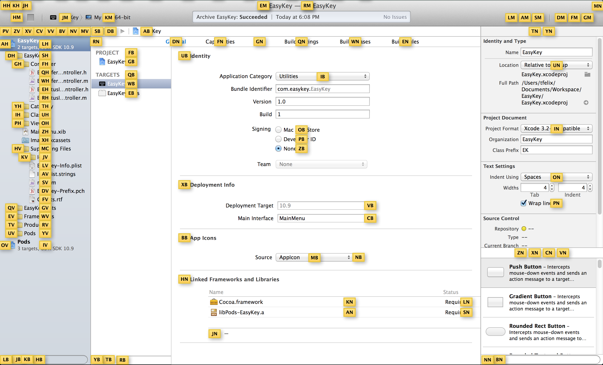

EasyKey
=====

This is an utility tool that allows you to drive the navigation on mac using just your keyboard, similar to [shortcap](//shortcatapp.com).

It was shameless inspired by [vimium project](http://vimium.github.io/)

Every contribution is very welcome, but please keep things easy to work on. **It also need a better/cool name, help on that is welcome too.**.

Getting started
-------------

### Installing

You can download [EasyKey.app](EasyKey/EasyKey.app) or clone this repo and run the same file locally.

You have to authorize EasyKey under your accessibility preferences panel in order to make it works.

Once you have it installed, authorized and running you should see an little keyboard icon on your status bar, it means you done successfully, just type the default shortcut CMD+SHIFT+ENTER to see the magic happening.

### Building

* Install ruby
* Install cocoapods gem
* Clone this repo
* Run ``pods install`` on the project folder
* You are ready to run it!

References
----------

Easy key is heavily based on the following concepts/tools:

* [Cocoa NSAccessibility_Protocol](//developer.apple.com/library/mac/documentation/Cocoa/Reference/ApplicationKit/Protocols/NSAccessibility_Protocol/index.html): Official documentation about Cocoa Accessibility Protocol
* [robrix/Haxcessibility](//github.com/robrix/Haxcessibility): Objective-C Wrapper for NSAccessibility API
* [Quartz Events Services](//developer.apple.com/library/mac/documentation/Carbon/Reference/QuartzEventServicesRef/index.html)

LICENSE
--------
[MIT](LICENSE)
